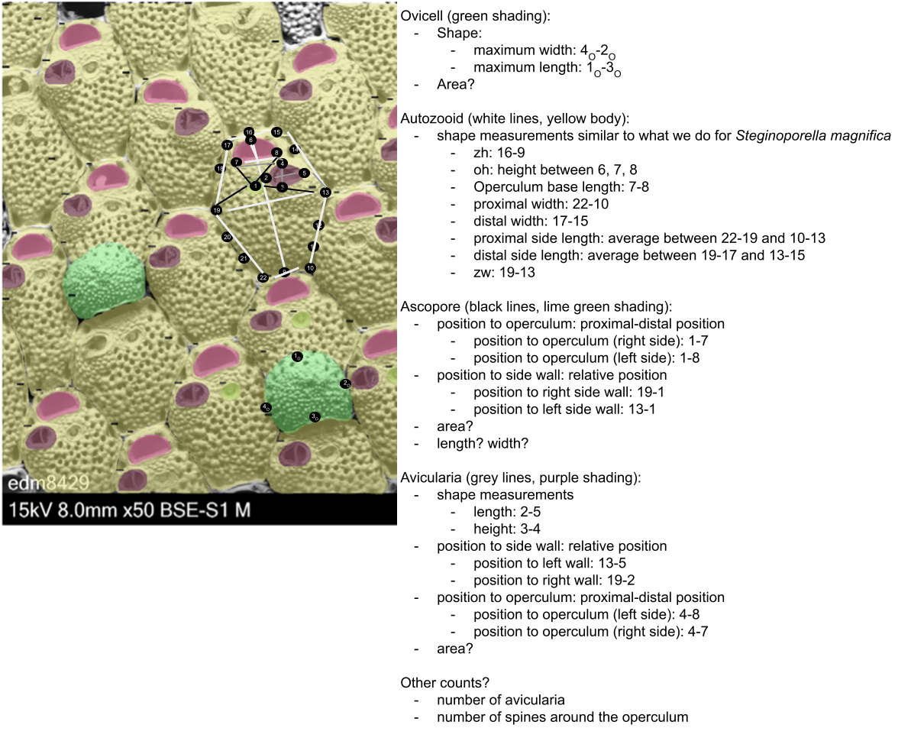

# microporella
Extraction of traits from morphological modules of _Microporella_ species

# Images

The images are SEM images of _Microporella_ collected from New Zealand. These specimens are both modern and paleo (~2.3 Mya).

The images were collected by K. Voje, L.H. Liow, E. Di Martino, and others as part of the WABO expeditions. The specimens were imaged by M. Ramsfjell and E. Di Martino.

Images are stored on a shared lab computer and will be made available with the publication of this project.

# Metadata

## Imaging metadata

The metadata file "[Microporella_SEMs_EDM+Mali_05.06.2024.csv](https://github.com/megbalk/microporella/blob/main/Data/Microporella_SEMs_EDM%2BMali_05.06.2024.csv)" contains information about:
- Date: date of image in MM/DD/YYY format
- Image_ID: a unique specimen number
- Formation: formation from which specimens came
- Age: age of the formation in stages, not years
- Sample_ID: unique number assigned to collection sample
- Shell: unique number assigned to shell within collection sample (Sample_ID)
- Colony: unique number assigned to the colony on the shell (can be multiple on one shell)
- Genus: genus of the binomial
- Species: species of the binomial

# Traits

We extracted linear measurements from landmarks images of zooids.

The example is from [Di Martino et al. 2023](https://doi.org/10.1002/lom3.10563) and is of _Microporella discors_.

## Measurements

There are a total of 22 landmarks, numbered 1 to 14, 1O to 4O, and 1A to 1A.

The measurements were based off [Di Martino & Liow 2022](https://doi.org/10.1111/evo.14598) and [Schack et al. 2020](https://www.jstor.org/stable/26937017).

*Landmarks*

**Ovicell** (green shading):  
- 1O: distal end along midline
- 2O: left side along midline
- 3O: proximal end along midline
- 4O: right side along midline

**Autozooid** (yellow shading):  
- 1: center of ascopore
- 2: distal end of operculum along midline
- 3: right side of operculum at base
- 4: left side of operculum at base
- 5: proximal end along midline
- 6: left proximal end connection point with adjacent zooids
- 7: left proximal side at widest point, also a connection point between adjacent zooids
- 8: left distal side in line with base of operculum
- 9: left distal end connection point with adjacent zooids
- 10: distal end along midline
- 11: right distal end connection point with adjacent zooids
- 12: right distal side in line with base of operculum
- 13: right proximal side at widest point, also a connection point between adjacent zooids
- 14: right proximal end connection point with adjacent zooids

**Avicularia** (purple shading):  
- 1A: distal end along midline
- 2A: left side along midline
- 3A: proximal end along midline
- 4A: right side along midline

*Traits*

Linear measurements were extracted using the landmark coordinates.

**Ovicell** (green shading):  
&ensp;Shape:  
&ensp;&ensp;maximum width: 4O-2O  
&ensp;&ensp;maximum length: 1O-3O  
&ensp;&ensp;area

**Autozooid** (yellow shading, white lines):  
&ensp;Shape:  
&ensp;&ensp;zooid height: 10-5  
&ensp;&ensp;operculum (pink shading): height between 2, 3, 4  
&ensp;&ensp;operculum base length (pink shading): 3-4  
&ensp;&ensp;proximal width: 14-6  
&ensp;&ensp;distal width: 11-9  
&ensp;&ensp;proximal side length: average between 13-14 and 6-7  
&ensp;&ensp;distal side length: average between 13-11 and 7-9  
&ensp;&ensp;zooid width: 13-7  
&ensp;&ensp;area

**Ascopore** (lime green shading, black lines):  
&ensp;Shape:  
&ensp;&ensp;area  
&ensp;Position to operculum: proximal-distal position  
&ensp;&ensp;position to operculum (right side): 1-3  
&ensp;&ensp;position to operculum (left side): 1-4  
&ensp;Position to side wall: relative position  
&ensp;&ensp;position to right side wall: 13-1  
&ensp;&ensp;position to left side wall: 7-1

**Avicularia** (purple shading):  
&ensp;Shape:  
&ensp;&ensp;length: 2A-4A  
&ensp;&ensp;height: 1A-3A  
&ensp;&ensp;area  
&ensp;Position to operculum: proximal-distal position  
&ensp;&ensp;position to operculum (left side): 2A-7  
&ensp;&ensp;position to operculum (right side): 2A-13  
&ensp;Position to side wall: relative position  
&ensp;&ensp;position to left wall: 1A-4  
&ensp;&ensp;position to right wall: 1A-3

# Automation

We use two steps for gathering linear measurements:

1. [DeepBryo](https://github.com/agporto/DeepBryo/), a tool developed by [Di Martino et al. 2023](https://doi.org/10.1002/lom3.10563) and which we forked for our project ([DeepBryo_micro](https://github.com/megbalk/DeepBryo_micro))
  - this provides segmentation of morphological features of _Microporella_ colonies
  - the program also extracts area

2.  [ML-morph](https://github.com/agporto/ml-morph) a tool developed by [Porto & Voje 2020](https://doi.org/10.1111/2041-210X.13373) and forked for our project ([ml-morph_micro](https://github.com/megbalk/ml-morph_micro))
   - this tool automatically places landmarks on images after a bit of training

The output of the machine learning pipeline is a csv file of:
- id of the image (specimenNR_NR of pics_AV_magnification_backscatter)
- box_id, a unique identifier for the zooid in the image (box_top_box_left_box_width_box_height)
- box_top
- box_left
- box_width
- box_height
- Xn cooridnate, where n corresponds to the landmark number for landmarks 0-22
- Yn coordinate, where n corresponds to the landmark number for landmarks 0-22

# Data processing

We check the metadata for every image in the scripts [microporella_imageMetadata.R](https://github.com/megbalk/microporella/blob/main/Scripts/microporella_imageMetadata.R) and [microporella_metadata.R](https://github.com/megbalk/microporella/blob/main/Scripts/microporella_metadata.R) to restrict images that have the same magnification (x50) and remove any duplicates.

In the code, "[fileNames.R](https://github.com/megbalk/microporella/blob/main/Scripts/filterImages.R)", reads in the image names and associated metadata file name and creates the dataset, "[image.filter.csv](https://github.com/megbalk/microporella/blob/main/Data/image.filter.csv)".
