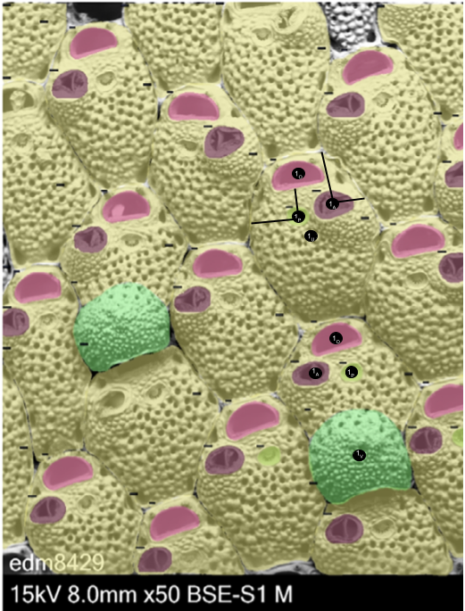

# microporella
Extraction of traits from morphological modules of _Microporella_ species

# Images

The images are SEM images of _Microporella_ collected from New Zealand. These specimens are both modern and paleo (~2.3 Mya).

The images were collected by K. Voje, L.H. Liow, E. Di Martino, and others as part of the WABO expeditions. The specimens were imaged by M. Ramsfjell and E. Di Martino.

Images are stored on a shared lab computer and will be made available with the publication of this project.

# Metadata

## Imaging metadata

The metadata file "[Microporella_SEMs_EDM+Mali_05.06.2024.csv](https://github.com/megbalk/microporella/blob/main/Data/Microporella_SEMs_EDM%2BMali_05.06.2024.csv)" contains information about:
- Date: date of image in MM/DD/YYY format
- Image_ID: a unique specimen number
- Formation: formation from which specimens came
- Age: age of the formation in stages, not years
- Sample_ID: unique number assigned to collection sample
- Shell: unique number assigned to shell within collection sample (Sample_ID)
- Colony: unique number assigned to the colony on the shell (can be multiple on one shell)
- Genus: genus of the binomial
- Species: species of the binomial

We also compared the images to those used in [Liow et al. 2024](https://doi.org/10.1086/731332) (see [dataset here](https://github.com/meghalithic/bryo_metadata/blob/main/metadata/Microporella_SELECT_final_datasets_26.01.2023.xlsx))

# Traits

We extracted linear measurements from landmarks images of zooids.

The image below is from [Di Martino et al. 2023](https://doi.org/10.1002/lom3.10563) and is of _Microporella discors_.

There are a total of 22 landmarks, numbered 1 to 14, 1O to 4O, and 1A to 1A.

The measurements were based off [Di Martino & Liow 2022](https://doi.org/10.1111/evo.14598) and [Schack et al. 2020](https://www.jstor.org/stable/26937017).

*Landmarks*

**Ovicell** (green shading):  
- 1V: centroid

**Autozooid** (yellow shading):  
- 1U: centroid
  
**Ascopore** (lime green shading):  
- 1P: centroid

**Operculum** (pink shading):  
- 1O: centroid

**Avicularia** (purple shading):  
- 1A: centroid

*Measurements*

Linear measurements were extracted using dimensions of the mask (see [DeepBryo_micro](https://github.com/meghalithic/DeepBryo_micro)).

**Ovicell** (green shading):  
&ensp;Shape:  
&ensp;&ensp;maximum width  
&ensp;&ensp;maximum length  
&ensp;&ensp;area

**Autozooid** (yellow shading):  
&ensp;Shape:  
&ensp;&ensp;zooid length (height)  
&ensp;&ensp;zooid width  
&ensp;&ensp;area

**Ascopore** (lime green shading, black lines):  
&ensp;Shape:  
&ensp;&ensp;area  
&ensp;Position on autozooid  
&ensp;&ensp;distance from distal wall (intersection between vertical midline of ascopore mask and autozooid mask)  
&ensp;&ensp;distance from lateral wall (intersection between horizontal midline of aspcopore mask and autozooid mask)

**Operculum** (pink shading):  
&ensp;Shape:  
&ensp;&ensp;area  
&ensp;&ensp;length  
&ensp;&ensp;width  
&ensp;Amount covered by ovicell

**Avicularia** (purple shading):  
&ensp;Shape:  
&ensp;&ensp;length  
&ensp;&ensp;height  
&ensp;&ensp;area  
&ensp;Position on autozooid  
&ensp;&ensp;distance from distal wall (intersection between vertical midline of avicularium mask and autozooid mask)  
&ensp;&ensp;distance from lateral wall (intersection between horizontal midline of avicularium mask and autozooid mask

# Automation

We use [DeepBryo](https://github.com/agporto/DeepBryo/), a tool developed by [Di Martino et al. 2023](https://doi.org/10.1002/lom3.10563) and which we forked for our project ([DeepBryo_micro](https://github.com/megbalk/DeepBryo_micro)), to extract measurements. This code provides segmentation of morphological features of _Microporella_ colonies. We modified the code to also output minimum bounding box and polygon coordinates to: extract relative position of avicularia and ascopores on autozooids, match masks of the ascopore, avicularia, operculum, and ovicell to the autozooid, check for any errors in segementation.

The output of the machine learning pipeline is a csv file of (trimmed to the columns of interest):
- index of the structure id
- image_id: image name
- category: type of structure (i.e., autozooid, ascopore, operculum, avicularia, or ovicell)
- area: area of mask
- circularity
- majorAxis: height of structure
- minorAxis: width of structure
- center_x: x-axis for centroid
- center_y: y-axis for centroid
- polygon: json of polygon vertices
- min_bbox_points: bbox coordinates for top, left, bottom, right
- unit: if pixels or scaled

# Data processing

We check the metadata for every image in the scripts [microporella_imageMetadata.R](https://github.com/megbalk/microporella/blob/main/Scripts/microporella_imageMetadata.R) and [microporella_metadata.R](https://github.com/megbalk/microporella/blob/main/Scripts/microporella_metadata.R). (See [note on processing](https://github.com/meghalithic/microporella/issues/5))

In the code, "[fileNames.R](https://github.com/megbalk/microporella/blob/main/Scripts/filterImages.R)", reads in the image names and associated metadata file name and creates the dataset, "[image.filter.csv](https://github.com/megbalk/microporella/blob/main/Data/image.filter.csv)".
